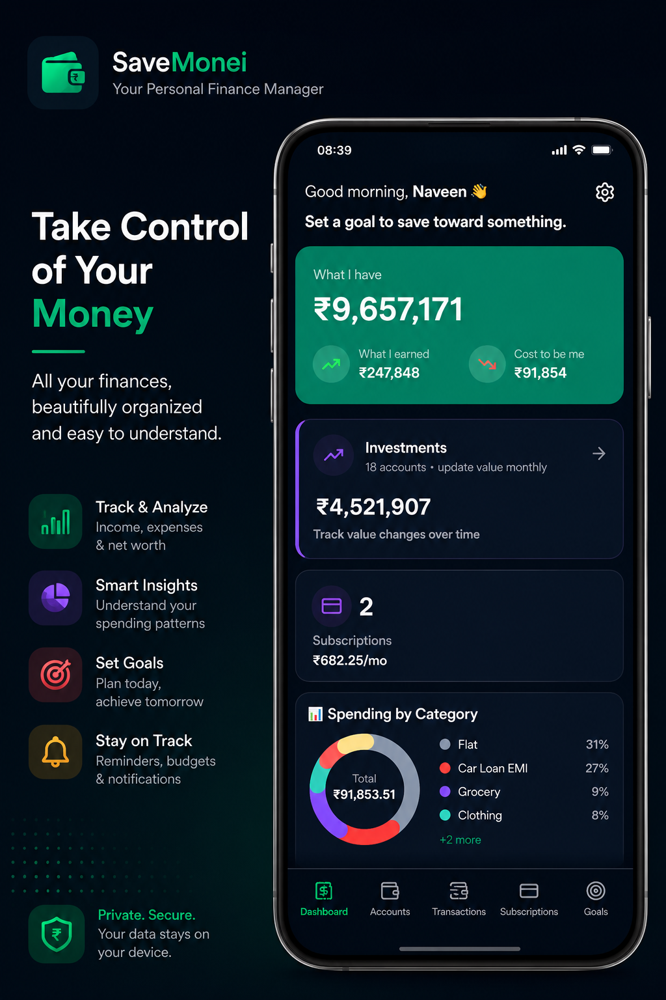
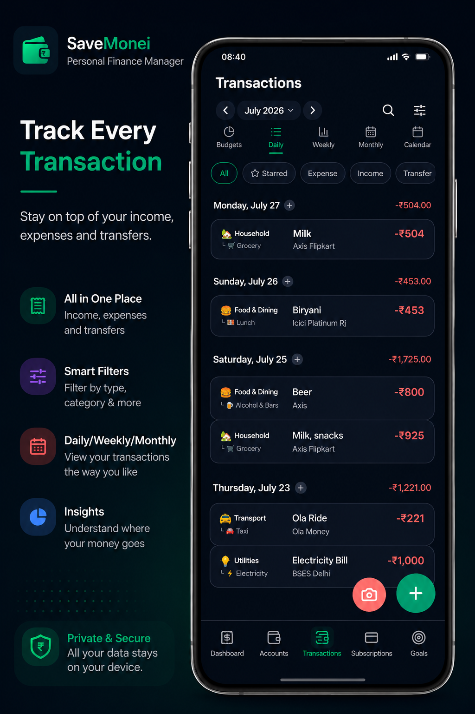

# SaveMonei — Money Manager & Finance Buddy

**SaveMonei** is a modern **personal finance app** that helps you track income, expenses, accounts, budgets, savings goals, subscriptions, and loans — with a focus on **privacy** and **offline-first** local storage.

> Your money. Your device. Your control.

---

## Download SaveMonei

| Platform | Link |
|----------|------|
| **Android** | [Google Play Store](https://play.google.com/store/apps/details?id=com.savemonei.app) |
| **iOS** | [savemonei.app](https://savemonei.app) |
| **Website** | [savemonei.vercel.app](https://savemonei.vercel.app) |

**Package ID:** `com.savemonei.app`

---

## Why SaveMonei?

SaveMonei is built for people who want a **simple expense tracker** and **budget app** without the clutter of traditional finance tools.

- **Track every rupee, dollar, or euro** — multi-currency support
- **See where your money goes** — categories, reports, and insights
- **Plan ahead** — budgets, savings goals, and recurring subscriptions
- **Stay private** — core data lives on your device in SQLite
- **Works offline** — log transactions anytime, sync when you're ready
- **Smart help** — built-in AI assistant for money questions and app guidance

---

## Features

### Money tracking
- **Dashboard** — income vs expenses, quick stats, and personalized tips
- **Transactions** — add, edit, split, repeat, and search instantly
- **Accounts** — cash, bank, cards, investments, and loans in one place
- **Transfers** — move money between accounts

### Planning & control
- **Budgets** — spending limits by category
- **Goals** — savings targets and progress tracking
- **Subscriptions** — recurring bills, trials, and renewal reminders
- **Loans** — balances and EMI tracking
- **Reports** — charts and spending breakdowns by period

### Smart & secure
- **AI Assistant** — ask about spending, budgets, goals, and how to use the app
- **Receipt scan** — camera + OCR for quick expense entry
- **App lock** — Face ID / fingerprint protection
- **Bank notification drafts** — turn alerts into transaction drafts (Android)
- **Backup & export** — CSV/Excel export and restore

### Personalization
- **Onboarding** — life stage, goals, and app style tailored to you
- **Multi-currency** — device-detected with manual override
- **Dark mode** — automatic or manual theme
- **iOS widget** — glance at balances from your home screen

---

## Screenshots

<!-- Add 4–6 images for SEO and social previews -->
<!--  -->
<!--  -->

_Coming soon — add screenshots to `docs/screenshots/` and uncomment above._

---

## Tech stack

This repository contains the **SaveMonei mobile app** source code.

| Layer | Technology |
|-------|------------|
| Framework | [Expo](https://expo.dev) 57 + [React Native](https://reactnative.dev) |
| Navigation | [expo-router](https://docs.expo.dev/router/introduction/) |
| Local database | [expo-sqlite](https://docs.expo.dev/versions/latest/sdk/sqlite/) |
| State | React Context + [TanStack Query](https://tanstack.com/query) |
| Auth | Email OTP via SaveMonei backend |
| Analytics | Firebase Analytics & Crashlytics |

Related repos:
- **Marketing site** — privacy, terms, contact ([savemonei.vercel.app](https://savemonei.vercel.app))
